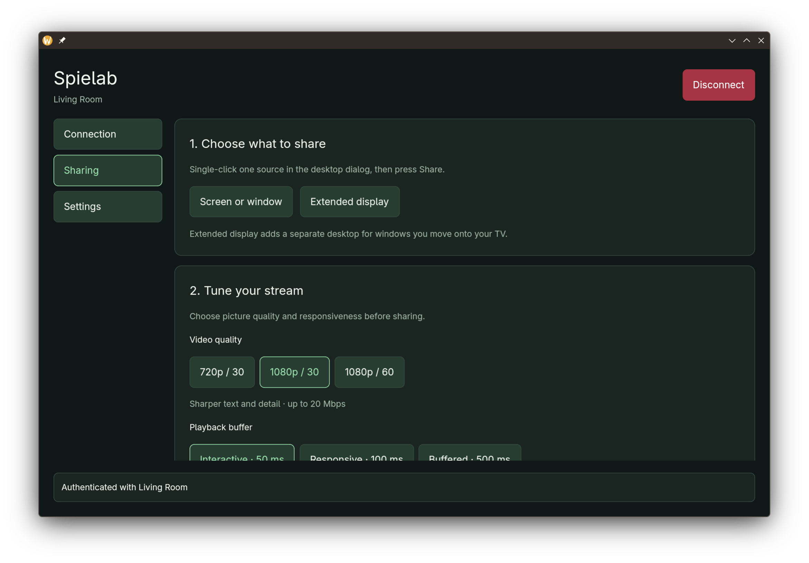

# Spielab

A native Rust + GPUI app for sharing a Linux Wayland desktop with Apple TV, including system audio.



## Features

- Share a screen or window, or create an extended display on supported desktops.
- H.264 video at 720p/30, 1080p/30, or 1080p/60.
- Automatic VA-API hardware encoding with software fallback when hardware is unavailable.
- Selectable 50, 100, or 500 ms playback buffers. These are buffer targets, not total display latency.
- Saved Apple TV pairing and light/dark themes.

Targets modern Apple TVs with HomeKit pairing and PTP timing. HEVC, NVENC, and legacy FairPlay/NTP receivers are not supported yet.

## Requirements

- Linux with Wayland, Vulkan graphics drivers, PipeWire, and a working ScreenCast desktop portal.
- Rust, a C linker, pkg-config, FreeType, Fontconfig, libxkbcommon, and libxkbcommon-x11.
- GStreamer 1.22+ (`gst-launch-1.0`) with `pipewiresrc`, `queue`, `videoconvertscale`, `videorate`, `y4menc`, and `fdsink`. `pipewiresrc` must support `keepalive-time`.
- FFmpeg with `libx264`, plus PipeWire's `pw-cat`. GPU encoding also requires `h264_vaapi`, a compatible VA-API driver, and access to `/dev/dri/renderD*`.
- Apple TV on the same network with AirPlay enabled.

## Run

```sh
cargo run --locked
```

1. In **Connection**, select your Apple TV and enter its code if prompted.
2. Once authorized, **Sharing** opens. Choose a source, quality, and playback buffer.
3. In the desktop picker, **single-click one source, then press Share**. Avoid double-clicking on KDE to avoid a known portal crash.
4. Click **Start sharing**. System audio is included automatically.

Use **Disconnect / Cancel** at the top right, or Escape, to stop. **Settings → Appearance** controls dark mode. Disconnecting also removes any temporary extended display.

Pairing and preferences live in `$XDG_STATE_HOME/spielab` or `~/.local/state/spielab`. Override with `SPIELAB_STATE_DIR`. The optional `./scripts/run.sh` uses the checkout's `.cargo-home` cache by default and reuses `.state` when present.

For native Linux GUI builds, `build.rs` supplies a local linker symlink if the xkbcommon-x11 runtime is installed without its development symlink. No system files are modified.

## Development

```sh
cargo test --locked --no-default-features
cargo clippy --locked --all-targets -- -D warnings
```

Additional ignored tests exercise real preprocessing, encoding and decoding, and provide packet timing diagnostics. Run them with `cargo test --locked --no-default-features -- --ignored`; they require GStreamer and FFmpeg, and the hardware test requires VA-API H.264 on `/dev/dri/renderD128`. Measurements and reproduction commands are in [Performance](docs/performance.md).

CLI examples for discovery, pairing, and mirroring are in [`examples/`](examples/).

## License and acknowledgments

[GPL-2.0-only](LICENSE). Built using [airplay2-rs](https://github.com/lmcgartland/airplay2-rs), with protocol references from [Doubletake](https://github.com/omarroth/doubletake) and [UxPlay](https://github.com/FDH2/UxPlay).
